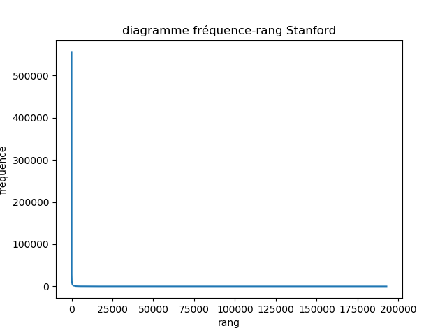
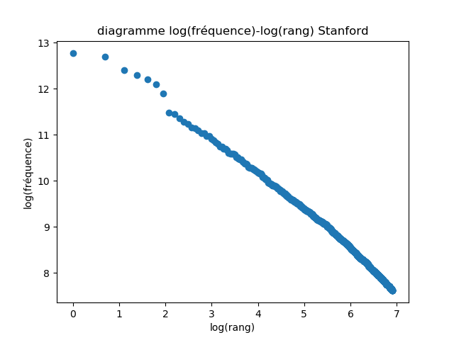
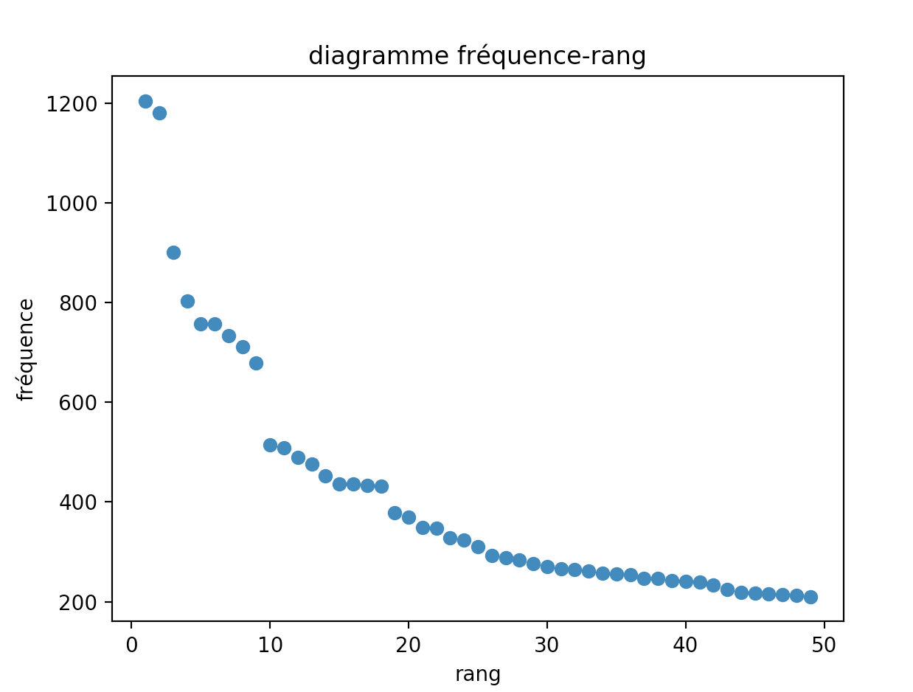
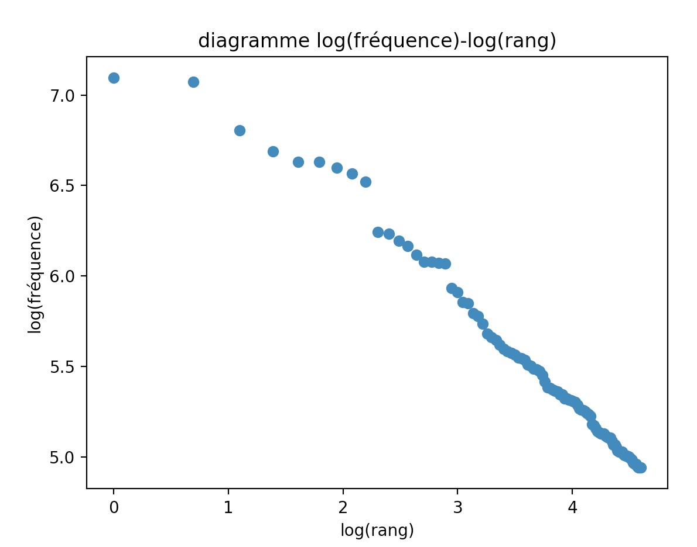
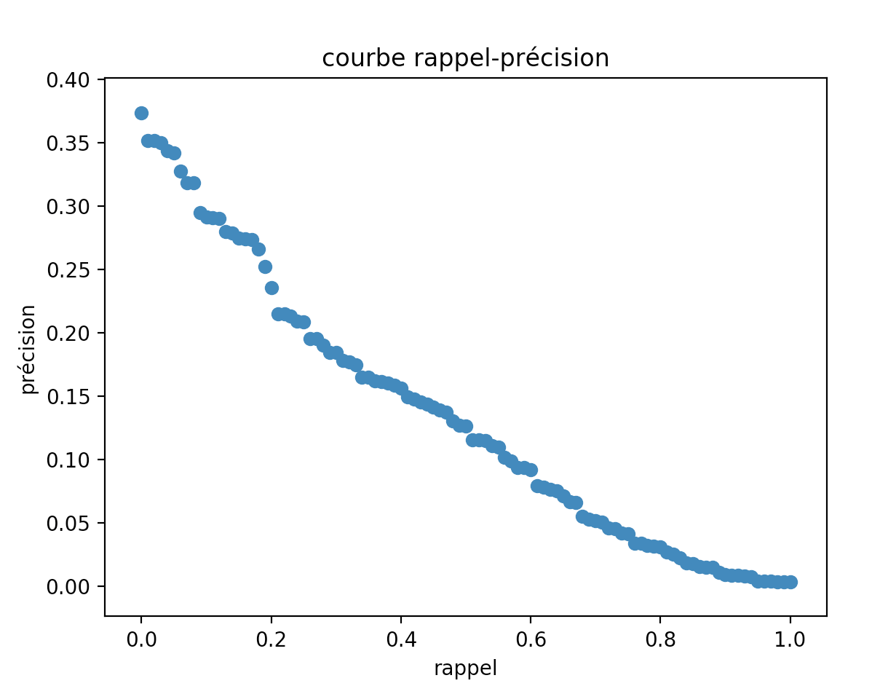

# Projet RIW

Moteur de recherche pour le cours de recherche d'information web.

## Réponses aux questions: 

### Stanford

1) Nombre de tokens: 24 745 048
2) Taille du vocabulaire: 337 147
3)
| Tokens     | vocabulaire    | k | b |
| --------|---------|-------|-------|
| 14 053 911   | 192 818   | 0,0168    |  0,9877 |
4) Avec la loi de Heaps, on aurait alors un vocabulaire de taille 14 173
5) 


### CACM

1) Nombre de tokens: 108 235 sans les stopwords
2) Taille du vocabulaire: 9 497
3) 
| Tokens     | vocabulaire    | k | b |
| --------|---------|-------|-------|
| 52 276  | 6 752   | 41,472    |  0,4687 |
4) Avec la loi de Heaps, on aurait alors un vocabulaire de taille 26 929.
5) 


### Courbe rappel précision

Voir le script rappel_precision.py pour voir comment elle a été obtenue.
Résultat: 


# Installation
```
git clone https://github.com/josephsayegh/RIW.git
```

La collection Stanford devrait être placée dans un dossier appelé Stanford au même niveau de CACM.

Pour creer l'index de CACM:
```
python cacm_index_creator.py
```
Pour creer l'index de Stanford:
```
python stanford_index_creator.py
```
Pour effectuer une recherche booléenne sur CACM:
```
boolean_research_cacm.py
```
Pour effectuer une recherche booléenne sur Stanford:
```
boolean_research_stanford.py
```
Pour effectuer une recherche vectorielle sur Stanford:
Lancer (environ une minute ou deux)
```
vectorial_search_norm_creation_stanford.py
```
puis
```
vectorial_search_functions_stanford.py
```
Pour afficher la courbe de rappel-précision:
Placer les deux docs query.text et qrels.text dans le dossier RIW. Lancer 
```
SplitandClean_queries.py
```
Lancer 
```
rappel_precision.py
```

# Architecure

## /CACM 
Contient de base cacm.all, commond_words, qrels.text, query.text, splitandclean.py

splitandclean.py sert ainsi à parser cacm.all et créer un dossier Collection qui va contenir un fichier 
par document, avec les sections qui nous intéressent et les mots déjà tokenizés.

document_dictionary, inversed_index et terms_dictionary sont créés par la suite grâce à ```cacm_index_creator.py```

## /Requetes
Sera créé grâce à ```splitandClean_queries.py```.
Contient la liste des 64 requêtes retraitées. Utile pour lancer ```rappel_precision.py``` qui sert à afficher la courbe rappel-précision de CACM.

## /Stanford
Contient /pa1-data qui lui même contient la collection entière de Stanford

## /Stanford_indexes
Sera créé grâce à ```stanford_index_creator.py``` et contient les indexes inversés de chaque bloc,
les indexes fusionnés deux à deux puis quatre à quatre et enfin final_index qui est ainsi construit
avec la méthode bsbi. 
Contient aussi doc_id_dictionary qui permet de faire la correspondance doc_id - document


